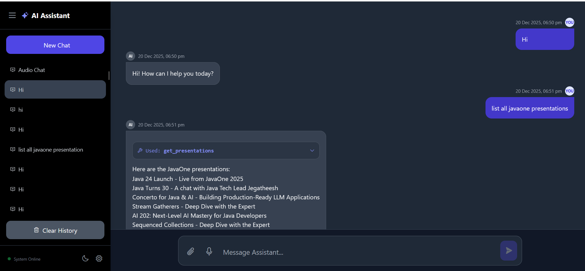

# AI Chat Assistant

A versatile, self-contained AI chat application featuring a modern web interface, multi-modal capabilities, and powerful tool integration through the Master Control Protocol (MCP).

This application provides a seamless chat experience, allowing you to interact with OpenAI-compatible language models. It supports text, image, and audio inputs, and can be extended with custom tools to perform a wide range of tasks.



## Features

- **Multi-Modal Conversations:** Interact with the AI using text, images, and audio recordings.
- **Extensible Tooling (MCP):** Dynamically connect to a **Master Control Protocol (MCP)** server to give the AI access to custom tools (e.g., file system access, web search, code execution).
- **Rich Web Interface:** A clean, responsive, and feature-rich UI built with vanilla JavaScript and Tailwind CSS.
- **Chat History:** Automatically saves conversation history, allowing you to load, rename, and delete previous chats.
- **Real-time Streaming:** Responses from the AI are streamed in real-time for a smooth, interactive experience.
- **Easy Configuration:** Configure the model, API keys, and MCP connection through the UI or environment variables.
- **Dark/Light Mode:** Switch between themes to suit your preference.
- **Standalone & Portable:** Runs locally with Python and a web browser.

## Architecture

The application consists of a Python backend and a JavaScript frontend, designed for modularity and ease of use.

```
+------------------------+      +-----------------------+
|   Browser (Frontend)   |      |   Python (Backend)    |
| (main.js, index.html)  |<---->| (app.py, FastAPI)     |
+------------------------+      +-----------------------+
           ^                                |
           |                                | (OpenAI API)
           v                                v
+------------------------+      +-----------------------+
|  User (Text, Images,   |      |   LLM Provider        |
|  Audio)                |      | (e.g., Ollama, OpenAI)|
+------------------------+      +-----------------------+
                                          ^
                                          | (Tool Use)
                                          v
+------------------------+      +-----------------------+
|   MCP Server           |      |                       |
| (External Tools)       |<---->|   MCP Manager         |
| e.g., filesystem-mcp   |      | (mcp_manager.py)      |
+------------------------+      +-----------------------+
```

1.  **Frontend:** A single-page application (`index.html`, `main.js`) that provides the chat interface. It communicates with the backend via a REST API.
2.  **Backend:** A **FastAPI** server (`app.py`) that handles:
    - Serving the web interface.
    - Managing chat sessions and history.
    - Orchestrating communication between the user, the LLM, and the MCP server.
3.  **MCP Manager (`mcp_manager.py`):** A crucial component that connects to an external MCP server. It discovers the tools the server provides and makes them available to the language model.
4.  **Configuration (`config.py`):** Manages settings from environment variables (`.env`) and a local JSON file (`data/saved_settings.json`).

## Getting Started

### Prerequisites

- Python 3.7+
- An OpenAI-compatible API. This can be the official OpenAI API or a local provider like [Ollama](https://ollama.com/).
- (Optional) An MCP server for tool integration. For an example, see the [Filesystem MCP Server](https://github.com/model-context-protocol/mcp-server-filesystem-ts).

### Installation

1.  **Clone the repository:**
    ```bash
    git clone https://github.com/Jegatheesh001/AI-ChatBot.git chatbot
    cd chatbot
    ```

2.  **Install dependencies:**
    ```bash
    pip install -r requirements.txt
    ```

### Running the Application

1.  **Set up your environment:**
    Create a `.env` file in the project root. This is the recommended way to manage your credentials and settings.

    ```env
    # .env
    
    # Example for Ollama (local)
    OPENAI_API_KEY="ollama"
    OPENAI_BASE_URL="http://localhost:11434/v1"
    OPENAI_MODEL="llama3"

    # Example for OpenAI (cloud)
    # OPENAI_API_KEY="sk-your-openai-api-key"
    # OPENAI_BASE_URL="https://api.openai.com/v1"
    # OPENAI_MODEL="gpt-4o-mini"
    
    # (Optional) Command to start your MCP tool server
    # This will be executed by the backend on startup.
    # MCP_COMMAND="npx -y @modelcontextprotocol/server-filesystem /path/to/your/workspace"
    ```

2.  **Run the server:**
    ```bash
    python app.py
    ```
    The application will automatically open in your default web browser at `http://localhost:8000`.

## How to Use

### Basic Chat

- Simply type your message in the input box and press Enter or click the send button.
- The AI's response will be streamed back in real time.

### Multi-Modal Inputs

- **Images:** Drag and drop images onto the page, paste them from your clipboard, or use the paperclip icon to upload them.
- **Audio:** Click the microphone icon to record audio. Click it again to stop. You can then preview the audio before sending it.

### Tool Integration (MCP)

1.  **Start an MCP Server:** Ensure you have an MCP-compatible tool server running or provide the command to start it in your `.env` file (see `MCP_COMMAND`).
2.  **Connect the App:** The backend will automatically connect to the server on startup if `MCP_COMMAND` is set.
3.  **Use Tools:** The AI will now have access to the tools provided by the MCP server. When a task requires a tool, the AI will automatically execute it and use the result to inform its response. You will see a "Used: <tool_name>" block in the chat when a tool is called.

### Configuration Priority

The application loads settings with the following priority, allowing for flexible configuration:

1.  **UI Settings (`data/saved_settings.json`):** Settings saved via the UI's "Configuration" menu have the highest priority.
2.  **Environment Variables (`.env` file):** Settings defined in the `.env` file are loaded next.
3.  **Default Values:** Fallback default values are defined in `components/config.py`.